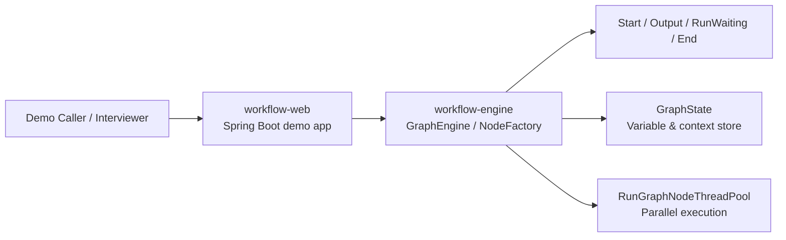

# workflow-showcase-platform

> Engine-first public showcase of an AI workflow orchestration platform with a self-built DAG runtime, pluggable node system, and runnable local demo profile.

## 中文简介

这是一个面向公开仓库重构后的 AI Workflow Orchestration Platform 展示版。  
公开版保留了原项目最值得展示的部分：多模块 Spring Boot 架构、自研 DAG 执行引擎、节点体系、并行调度模型，以及面向 AI 编排和文档处理场景的扩展思路。

这个仓库不是企业内网版本的直接开源镜像，而是一个专门为了 GitHub 展示和面试讲解整理出的 public edition：

- 保留核心引擎结构和模块边界
- 去除私有基础设施、闭源依赖和敏感配置
- 用 `demo` profile 提供可本地启动、可真实访问的最小演示路径

## English Overview

`workflow-showcase-platform` is a public, interview-ready refactor of a production-style workflow system.  
The repository keeps the strongest technical parts of the original codebase: a multi-module Spring Boot layout, a graph-oriented execution engine, a node abstraction model, parallel scheduling, and an extension story for AI/document workflows.

This public edition is intentionally not a 1:1 copy of the internal platform. Instead, it delivers an honest and runnable demo slice:

- the engine architecture is preserved
- private enterprise integrations are removed or replaced
- the `demo` profile is the official local run path

## Why It Stands Out

- Self-built DAG execution engine instead of a CRUD-style orchestration shell
- Clear node abstraction with execution routing, state passing, and end-node materialization
- Runnable parallel branch + join demo that makes the scheduling model visible
- Public-edition refactor that keeps architectural depth while removing private infrastructure and secrets

## Core Highlights

- `workflow-engine` keeps the execution core: graph loading, node creation, routing, state persistence, and parallel dispatch.
- `workflow-web` exposes a runnable Spring Boot demo API for an end-to-end showcase flow.
- `workflow-pojo` and `workflow-utils` preserve the shared contract and utility split from the original multi-module design.
- `workflow-admin` is intentionally kept as a reserved module boundary in the public edition, even though enterprise-facing adapters were removed.

## Architecture



The public demo follows the same architectural direction as the larger internal platform: the web layer provides orchestration entrypoints, the engine owns graph execution, and nodes remain the unit of behavior.  
For the public release, enterprise integrations were cut first, while the execution model was kept intact.  
That means the local demo still shows real branching, parallel node scheduling, join synchronization, variable propagation, and workflow completion.

## Repository Structure

```text
workflow-showcase-platform/
|- workflow-pojo
|- workflow-utils
|- workflow-engine
|- workflow-admin
|- workflow-web
|- doc
```

- `workflow-pojo`: shared public DTOs and enums used by the engine demo.
- `workflow-utils`: lightweight utility layer rebuilt for the public edition.
- `workflow-engine`: graph runtime, node model, scheduling, callback, and execution state.
- `workflow-admin`: reserved module boundary kept for architectural completeness; enterprise adapters are intentionally removed.
- `workflow-web`: Spring Boot entrypoint and local runnable `demo` profile.
- `doc`: public technical notes for GitHub and interview walkthroughs.

## Demo Scenario

The default demo flow is an engine-first showcase focused on parallel scheduling:

1. `Start` emits guide text and initializes graph state.
2. The graph branches into two parallel `Output` nodes.
3. Each branch simulates distinct work with different delays.
4. `RunWaitingNode` waits until both upstream branches finish.
5. `End` collects the final materialized outputs into workflow result variables.

This gives an interviewer something concrete to inspect:

- a graph definition
- a real engine run
- parallel execution behavior
- final aggregated workflow state

## Quick Start

### Prerequisites

- JDK 17
- Maven 3.9+

### Build

```bash
mvn -DskipTests package
```

### Run the Demo App

```bash
java -jar workflow-web/target/workflow-web-1.0.0-SNAPSHOT.jar --spring.profiles.active=demo
```

### Demo Endpoints

```bash
curl http://localhost:8080/api/demo/workflows/parallel-showcase
curl http://localhost:8080/api/demo/workflows/parallel-showcase/run
```

## Verified Demo Result

The current public demo has been locally verified with:

- scenario: `parallel-branch-join`
- workflow status: `COMPLETED`
- executed steps: `5`
- final outputs:
  - `branchA = Branch A produced a structured summary for the final report.`
  - `branchB = Branch B prepared a document-parsing insight package.`

## Configuration

The public edition uses `workflow-web/src/main/resources/application-demo.yml` as the official local profile.

Important knobs:

- `workflow.max-steps`: graph-level step guard
- `workflow.async-enabled`: whether node execution uses the parallel pool
- `workflow.graph-engine.core-pool-size`: demo thread pool size
- `workflow.graph-engine.max-pool-size`: upper bound for parallel execution
- `workflow.graph-engine.queue-size`: bounded queue for submitted node tasks

## Public Edition Notes

What is real in this repository:

- multi-module architecture
- graph runtime skeleton
- node lifecycle and routing model
- parallel branch execution
- join/wait synchronization
- final workflow output materialization

What is intentionally removed or mocked:

- Nacos and service discovery
- internal Redis / MySQL / Milvus / Elasticsearch / MinIO dependencies
- private SSO and cloud SDKs
- closed-source jars and commercial document-processing packages
- internal business flows, interview drafts, and environment-specific scripts

## Security and Sanitization

This public snapshot was rebuilt for open publication:

- live credentials, private endpoints, bundled internal jars, and internal docs were removed
- enterprise-only dependencies were replaced by a minimal public dependency set
- the repository now ships a local `demo` run path instead of a production-like internal startup path

## Engineering Tradeoffs

- The first public pass preserves module and package shape where it helps readability, instead of doing a risky full namespace rename.
- The public release prioritizes one truthful runnable slice over pretending the full internal platform is portable.
- `workflow-admin` remains as a structural module boundary even though its enterprise implementation was removed, because that split is still useful in architecture discussions.

## Interview Talking Points

- Why a workflow system benefits from a graph engine instead of direct controller-to-service branching
- How node abstractions make scheduling, routing, and capability expansion easier
- Why public refactoring should cut infrastructure coupling before cutting core product logic
- How the demo still proves real engine behavior even without private enterprise integrations

## Docs

- [Graph Engine Architecture](./doc/graph-engine-architecture.md)
- [Node System and Interaction Model](./doc/node-system-and-interaction.md)
- [Public Edition Refactor Tradeoffs](./doc/public-edition-tradeoffs.md)
