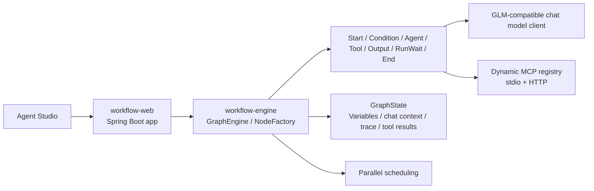

# workflow-showcase-platform

> Build visual agent workflows on top of a self-built Java DAG engine: node orchestration, bounded ReAct loops, and dynamic MCP integration in one Studio.

## Overview

`workflow-showcase-platform` is a showcase repository centered on one clear question:

How do you turn a custom workflow engine into a usable agent platform instead of a static demo page?

## Project Snapshot

- Self-built Java graph engine instead of a thin wrapper around an existing agent framework
- One Studio that demonstrates both pure workflow orchestration and tool-using ReAct execution
- Dynamic MCP import with runtime discovery, health checks, and tool registration
- Public-safe release posture: real integration interfaces, but no bundled secrets or local-only runtime paths

This public edition keeps the parts that best answer that question:

- a self-built DAG runtime with explicit routing and state propagation
- a node model built around `Start`, `Condition`, `Agent`, `Tool`, `Output`, `RunWait`, and `End`
- bounded ReAct-style planning loops inside the graph engine
- dynamic MCP server discovery, import, health checking, and tool registration
- a browser-based `Agent Studio` that can run both agent workflows and pure node orchestration flows

## What You Can Demo Today

### 1. Agent Chat / ReAct Mode

The Studio can run a generic chat workflow that:

- accepts natural-language input
- exposes the selected MCP tools to a planning agent
- lets the planner choose tools, observe results, and decide again
- synthesizes the final answer after tool execution

This is useful for demonstrating:

- tool-aware planning
- multi-step agent loops
- MCP integration
- traceable decisions and tool activity

### 2. Workflow Orchestration Demo

The Studio also includes a nodes-only orchestration mode that does not rely on agent planning or MCP tools.

It demonstrates:

- parallel branching
- conditional routing
- `RunWait` join behavior
- conditional recovery/fallback
- final output aggregation through variable references

This is useful when you want to emphasize workflow composition itself rather than agent reasoning.

## Why This Project Stands Out

- The execution engine is first-class. The agent runtime is embedded in the graph instead of being bolted on as a separate chat sandbox.
- ReAct is bounded and inspectable. Iteration budgets, tool calls, observations, joins, and final synthesis are all visible in the runtime state.
- MCP is treated as a platform capability. Servers can be configured statically or imported at runtime through the Studio UI.
- The frontend is not a mock shell. It builds real workflow requests, streams results, and exposes trace, timeline, variables, and tool activity.

## Architecture



## Repository Structure

```text
workflow-showcase-platform/
|- workflow-pojo
|- workflow-utils
|- workflow-engine
|- workflow-admin
|- workflow-web
|- doc
|- scripts
```

- `workflow-pojo`: shared DTOs and enums
- `workflow-utils`: utility and Spring helper classes
- `workflow-engine`: graph runtime, node system, scheduling, state, agent/tool orchestration
- `workflow-admin`: reserved module boundary kept for the architecture story
- `workflow-web`: Spring Boot entrypoint, demo APIs, and the Studio frontend
- `doc`: public-facing notes and demo guides
- `scripts`: smoke and local verification helpers

## Public Release Posture

This repository is intentionally published as a safe public edition:

- no live API keys are stored in tracked runtime config
- no local `runtime/` paths are required in the default profile
- the default `demo` profile remains runnable without any external secret
- external LLM and MCP capabilities are preserved through environment variables, example config, and dynamic import

That means:

- the app starts out of the box
- workflow orchestration mode works immediately
- direct chat works in fallback mode without an LLM key
- real external MCP and real external LLM integration are still supported, but you configure them yourself

## Quick Start

### Prerequisites

- JDK 17
- Maven 3.9+

### Build

```bash
mvn -q -DskipTests package
```

### Run

```bash
java -jar workflow-web/target/workflow-web-1.0.0-SNAPSHOT.jar --spring.profiles.active=demo
```

### Open

```text
http://localhost:8080/
```

The homepage redirects to:

```text
http://localhost:8080/agent-studio.html
```

## Configuration Model

### Default Public Config

The tracked runtime config is:

- [application-demo.yml](./workflow-web/src/main/resources/application-demo.yml)

It is safe for GitHub and uses environment variables for any external LLM configuration. By default it does **not** preload MCP servers.

### Example Full Config

If you want a starting point for real external integration, use:

- [application-demo.example.yml](./workflow-web/src/main/resources/application-demo.example.yml)
- [application-demo.mcp-example.yml](./workflow-web/src/main/resources/application-demo.mcp-example.yml)

These example files show:

- GLM-compatible LLM configuration via environment variables
- stdio MCP examples for AMap and 12306
- a generic remote HTTP MCP example

### Example Environment Variables

Use:

- [`.env.example`](./.env.example)

This file is a tracked reference template for shell or CI environment variables. It is not auto-loaded by Spring Boot, but it documents the supported variable names.

## How To Add Real MCP Servers

You have two public-friendly options.

### Option 1. Dynamic Import In The Studio UI

This is the fastest way to demonstrate the platform:

1. Start the app.
2. Open `Agent Studio`.
3. Go to `Dynamic Import`.
4. Import a stdio MCP or HTTP MCP server.
5. Refresh metadata and select the imported tools.

This path is great for demos because it proves:

- runtime server discovery
- health checks
- imported tool registration
- immediate agent access to the imported tools

### Option 2. Static Config Through Example YAML

If you want repeatable local startup with preconfigured servers:

1. Copy `application-demo.example.yml`
2. Move the parts you want into `application-demo.yml` or override them with environment variables
3. Supply your own keys and commands

This path is better when you want a stable local dev profile.

## Installing MCP Runtimes

The public repo does not bundle local MCP runtimes.

Install them on your own machine, for example:

### AMap

```bash
npx -y @amap/amap-maps-mcp-server
```

Requires:

- `AMAP_MAPS_API_KEY`

### 12306

```bash
npx -y 12306-mcp
```

### Fetch

```bash
uvx mcp-server-fetch
```

After installation, either:

- configure the command in example YAML, or
- import the server from the Studio UI

## Suggested Demo Flow

### Workflow Mode

Use `Workflow Orchestration Demo` in the Studio and try a message like:

```text
I want a relaxed Nanjing itinerary and rainy weather is acceptable.
```

This shows:

- dual condition branches in parallel
- join behavior
- recovery routing
- final aggregation by workflow nodes only

### Agent / ReAct Mode

Import or configure one or more real MCP servers, select the tools, then try a message like:

```text
Plan a 3-day Nanjing trip. Use tools only when needed, and clearly mark any data you could not fetch.
```

This shows:

- planning
- tool selection
- observation-driven re-planning
- synthesis

## Verification

Recommended release checks for the public edition:

- `mvn -q -DskipTests compile`
- `mvn -q -DskipTests package`
- `scripts/run-e2e-smoke.ps1`

Current local verification for this snapshot:

- `mvn -q -DskipTests compile`
- default `demo` profile starts successfully
- `scripts/run-e2e-smoke.ps1 -StartApp $false -BaseUrl 'http://127.0.0.1:8080'` baseline flow passed
- dynamic MCP import remains available for real external integrations

For optional end-to-end verification scripts, see:

- [Agent Studio Demo Guide](./doc/studio-demo-guide.md)
- [External E2E Smoke Test](./doc/external-e2e-smoke-test.md)

## Docs

- [Agent Studio Demo Guide](./doc/studio-demo-guide.md)
- [Graph Engine Architecture](./doc/graph-engine-architecture.md)
- [Node System and Interaction Model](./doc/node-system-and-interaction.md)
- [Public Edition Refactor Tradeoffs](./doc/public-edition-tradeoffs.md)
- [ReAct Evolution Plan](./doc/react-evolution-plan.md)
