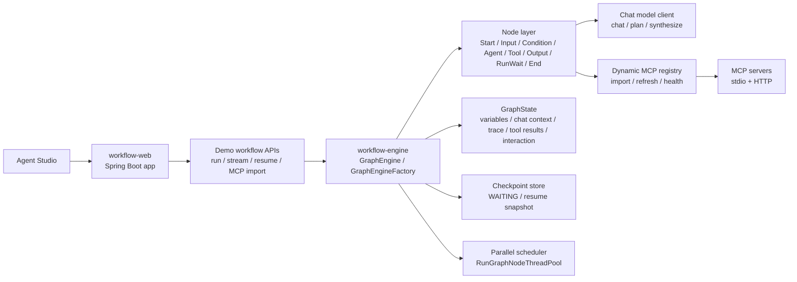
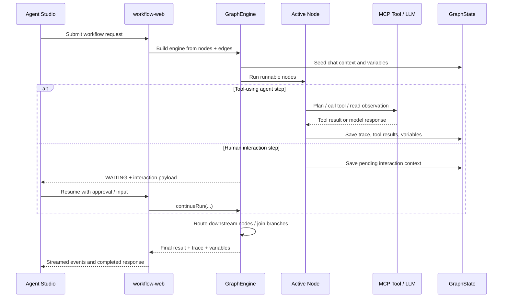

# workflow-showcase-platform

> A public showcase of a self-built Java workflow and agent runtime: DAG orchestration, bounded ReAct loops, dynamic MCP import, and human-in-the-loop resume in one Studio.

## 中文快速说明

这是一个偏 `AI Agent Runtime / Workflow Engine` 方向的公开展示项目，不是单纯的聊天页面 demo。

它主要展示三件事：

- 自建 Java DAG 工作流运行时，而不是套一层现成 Agent 框架
- 在同一个运行时里承载节点编排、bounded ReAct、多工具调用、人工确认与恢复
- 通过一个前端 `Agent Studio` 去真实驱动后端执行流、展示 trace / timeline / variables / tool activity

如果你第一次看这个仓库，建议按下面顺序理解：

1. 先跑 `Workflow-Only Orchestration Mode`
2. 再跑 `Agent Chat / ReAct Mode`
3. 最后回头看 `workflow-engine` 里的 `GraphEngine`、`GraphState`、`AgentNode`

## Why This Repo Exists

Most workflow or agent demos stop at a static canvas or a thin wrapper around an existing framework.

This project goes one layer deeper: it shows how a custom Java DAG engine can evolve into a usable agent platform with real execution state, real tool routing, resumable interaction, and a frontend that actually drives the runtime instead of mocking it.

## First-Screen Highlights

- Self-built `GraphEngine` and node runtime, not a wrapper around LangGraph-style infrastructure
- One `Agent Studio` that demonstrates both pure node orchestration and tool-using ReAct execution
- Dynamic MCP import with runtime discovery, health checks, and immediate tool registration
- Human-in-the-loop `WAITING` and resume flow for `InputNode` and final agent confirmation
- Public-safe release posture: real integration interfaces, no bundled secrets, no local-only runtime paths

## What You Can Demo In 5 Minutes

### 1. Agent Chat / ReAct Mode

Run a generic chat workflow that:

- accepts natural-language input
- exposes selected MCP tools to a planning agent
- lets the planner call tools, observe results, and decide again
- pauses at the final plan for human confirmation
- synthesizes the final answer after approval

This is the fastest path to show:

- bounded multi-step ReAct
- tool-aware planning
- MCP integration
- traceable decisions, tool calls, and final synthesis

### 2. Workflow-Only Orchestration Mode

Run a nodes-only workflow that does not rely on LLM planning or MCP tools.

It demonstrates:

- input pause and resume
- parallel dual-branch routing
- conditional recovery/fallback
- `RunWait` join behavior
- final output aggregation through variable references

This mode is useful when you want to emphasize workflow composition, routing semantics, and execution control instead of agent reasoning.

### 3. Runtime MCP Import

Use the Studio UI to import a stdio MCP or HTTP MCP server at runtime, refresh metadata, and immediately expose the imported tools to the agent workflow.

This is useful for showing:

- runtime server discovery
- imported tool registration
- health-aware tool exposure
- a more platform-like MCP story than hardcoded demo tools

## Why It Stands Out

- The execution engine is first-class. Agent behavior lives inside the graph runtime instead of being bolted onto a separate chat sandbox.
- ReAct is bounded and inspectable. Iteration budgets, tool calls, observations, joins, and final synthesis are visible in runtime state and trace output.
- MCP is treated as a platform capability. Servers can be configured statically or imported dynamically through the Studio.
- The frontend is part of the product story. It builds real workflow requests, streams execution, and exposes trace, timeline, variables, and interaction state.

## Architecture

### System View



### Runtime Lifecycle



### What This Architecture Is Showing

- `workflow-web` is not just a static demo shell. It exposes real run, stream, resume, and MCP import endpoints.
- `workflow-engine` owns queue progression, routing, bounded parallel execution, WAITING, and resume.
- `GraphState` is the shared runtime memory for variables, trace, tool results, chat context, and pending interaction.
- `AgentNode` and `ToolNode` let agent behavior live inside the same graph model as normal workflow nodes.
- MCP integration is dynamic: discovered tools are registered at runtime and then exposed back to the planner.

## Capability Map

| Area | What is implemented in this public repo |
|------|------------------------------------------|
| Workflow runtime | DAG execution, routing, joins, state propagation, bounded parallel scheduling |
| Agent runtime | Chat / plan / synthesize stages, bounded ReAct loop, observation-driven continuation |
| Human in the loop | `WAITING`, `resume`, `InputNode`, final-plan confirmation |
| Tooling | Dynamic MCP import, runtime discovery, tool registry, stdio / HTTP execution |
| Frontend | Real Studio request builder, streaming events, trace/timeline/variables views |
| Public demo posture | Runnable default profile, no bundled secrets, example config for external integrations |

## Repository Structure

```text
workflow-showcase-platform/
|- workflow-pojo
|- workflow-utils
|- workflow-engine
|- workflow-admin
|- workflow-web
|- doc
|- scripts
```

- `workflow-pojo`: shared DTOs and enums
- `workflow-utils`: utility and Spring helper classes
- `workflow-engine`: graph runtime, node system, scheduling, state, agent/tool orchestration
- `workflow-admin`: reserved module boundary kept for the architecture story
- `workflow-web`: Spring Boot entrypoint, demo APIs, and the Studio frontend
- `doc`: public-facing notes and demo guides
- `scripts`: smoke and local verification helpers

## Public Release Posture

This repository is intentionally published as a safe public edition:

- no live API keys are stored in tracked runtime config
- no local `runtime/` paths are required in the default profile
- the default `demo` profile remains runnable without any external secret
- external LLM and MCP capabilities are preserved through environment variables, example config, and dynamic import

That means:

- the app starts out of the box
- workflow orchestration mode works immediately
- direct chat works in fallback mode without an LLM key
- real external MCP and real external LLM integration are still supported, but you configure them yourself

## Quick Start

中文提示：
默认 `demo` profile 不要求先配置大模型 key，也不要求先装 MCP runtime。你可以先把项目跑起来看 workflow 模式，再决定要不要接真实 LLM / MCP。

### Prerequisites

前置环境：

- JDK 17
- Maven 3.9+

### Build

构建：

```bash
mvn -q -DskipTests package
```

### Run

启动：

```bash
java -jar workflow-web/target/workflow-web-1.0.0-SNAPSHOT.jar --spring.profiles.active=demo
```

### Open

访问：

```text
http://localhost:8080/
```

The homepage redirects to:

```text
http://localhost:8080/agent-studio.html
```

## Configuration Model

### Default Public Config

The tracked runtime config is:

- [application-demo.yml](./workflow-web/src/main/resources/application-demo.yml)

It is safe for GitHub and uses environment variables for any external LLM configuration. By default it does **not** preload MCP servers.

### Example Full Config

If you want a starting point for real external integration, use:

- [application-demo.example.yml](./workflow-web/src/main/resources/application-demo.example.yml)
- [application-demo.mcp-example.yml](./workflow-web/src/main/resources/application-demo.mcp-example.yml)

These example files show:

- GLM-compatible LLM configuration via environment variables
- stdio MCP examples for AMap and 12306
- a generic remote HTTP MCP example

### Example Environment Variables

Use:

- [`.env.example`](./.env.example)

This file is a tracked reference template for shell or CI environment variables. It is not auto-loaded by Spring Boot, but it documents the supported variable names.

### LLM API Key Setup

中文说明：
如果你只想先体验项目，不配 API Key 也能启动，系统会走本地 fallback 逻辑。
如果你想演示真正的 Agent 规划、多轮工具调用和更完整的综合回答，再配置下面这些环境变量。

The default `demo` profile reads LLM settings from environment variables:

- `LLM_PROVIDER`
- `LLM_MODEL`
- `LLM_BASE_URL`
- `ZAI_API_KEY`
- `GLM_API_KEY`
- `LLM_API_KEY`
- `OPENAI_API_KEY`

The key lookup order in [application-demo.yml](./workflow-web/src/main/resources/application-demo.yml) is:

1. `ZAI_API_KEY`
2. `GLM_API_KEY`
3. `LLM_API_KEY`
4. `OPENAI_API_KEY`

Example PowerShell setup for GLM:

PowerShell 示例：

```powershell
$env:LLM_PROVIDER="GLM"
$env:LLM_MODEL="glm-5.1"
$env:LLM_BASE_URL="https://open.bigmodel.cn/api/paas/v4"
$env:ZAI_API_KEY="your_api_key"

java -jar workflow-web/target/workflow-web-1.0.0-SNAPSHOT.jar --spring.profiles.active=demo
```

You can also override the same values directly on the command line:

也可以直接用命令行参数覆盖：

```powershell
java -jar workflow-web/target/workflow-web-1.0.0-SNAPSHOT.jar `
  --spring.profiles.active=demo `
  --llm.provider=GLM `
  --llm.model=glm-5.1 `
  --llm.base-url=https://open.bigmodel.cn/api/paas/v4 `
  --llm.api-key=your_api_key
```

## How To Add Real MCP Servers

You have two public-friendly options.

### Option 1. Dynamic Import In The Studio UI

This is the fastest way to demonstrate the platform:

1. Start the app.
2. Open `Agent Studio`.
3. Go to `Dynamic Import`.
4. Import a stdio MCP or HTTP MCP server.
5. Refresh metadata and select the imported tools.

This path is great for demos because it proves:

- runtime server discovery
- health checks
- imported tool registration
- immediate agent access to the imported tools

### Option 2. Static Config Through Example YAML

If you want repeatable local startup with preconfigured servers:

1. Copy `application-demo.example.yml`
2. Move the parts you want into `application-demo.yml` or override them with environment variables
3. Supply your own keys and commands

This path is better when you want a stable local dev profile.

## Installing MCP Runtimes

The public repo does not bundle local MCP runtimes.

Install them on your own machine, for example:

### AMap

```bash
npx -y @amap/amap-maps-mcp-server
```

Requires:

- `AMAP_MAPS_API_KEY`

### 12306

```bash
npx -y 12306-mcp
```

### Fetch

```bash
uvx mcp-server-fetch
```

After installation, either:

- configure the command in example YAML, or
- import the server from the Studio UI

## Suggested Demo Flow

### Workflow Mode

Use `Workflow Orchestration Demo` in the Studio and try a message like:

```text
I want a relaxed Nanjing itinerary and rainy weather is acceptable.
```

This shows:

- dual condition branches in parallel
- join behavior
- recovery routing
- final aggregation by workflow nodes only

### Agent / ReAct Mode

Import or configure one or more real MCP servers, select the tools, then try a message like:

```text
Plan a 3-day Nanjing trip. Use tools only when needed, and clearly mark any data you could not fetch.
```

This shows:

- planning
- tool selection
- observation-driven re-planning
- synthesis

## Verification

Recommended release checks for the public edition:

- `mvn -q -DskipTests compile`
- `mvn -q -DskipTests package`
- `scripts/run-e2e-smoke.ps1`

Current local verification for this snapshot:

- `mvn -q -DskipTests compile`
- default `demo` profile starts successfully
- `scripts/run-e2e-smoke.ps1 -StartApp $false -BaseUrl 'http://127.0.0.1:8080'` baseline flow passed
- dynamic MCP import remains available for real external integrations

For optional end-to-end verification scripts, see:

- [Agent Studio Demo Guide](./doc/studio-demo-guide.md)
- [External E2E Smoke Test](./doc/external-e2e-smoke-test.md)

## Docs

- [Agent Studio Demo Guide](./doc/studio-demo-guide.md)
- [Graph Engine Architecture](./doc/graph-engine-architecture.md)
- [Node System and Interaction Model](./doc/node-system-and-interaction.md)
- [Public Edition Refactor Tradeoffs](./doc/public-edition-tradeoffs.md)
- [ReAct Evolution Plan](./doc/react-evolution-plan.md)
