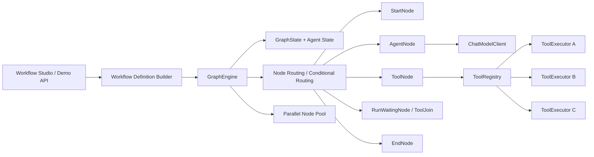
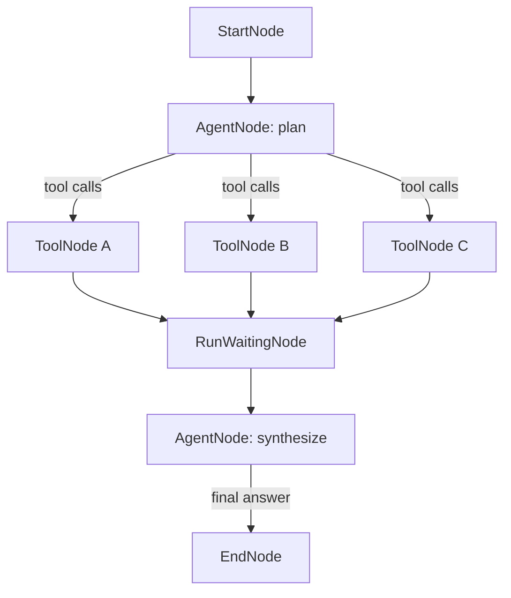

# ReAct Evolution Plan

## Positioning

This repository should evolve into a hybrid workflow engine:

- deterministic graph execution remains the core
- agent nodes become pluggable runtime units
- business workflows and agentic loops can be mixed in one graph
- parallel execution remains a first-class differentiator

The goal is not to clone LangGraph or langgraph4j 1:1. The goal is to keep the current engine-first design, then add a practical ReAct layer on top of it.

## Why This Direction Fits The Current Project

The current engine already has several properties that are useful for a ReAct runtime:

- explicit node lifecycle
- graph-level routing
- shared graph state
- parallel branch execution
- join/wait synchronization
- clear execution logs and callback hooks

That means the shortest path is:

1. extend state
2. add agent-oriented node types
3. add tool registry and tool execution nodes
4. add conditional routing semantics
5. add checkpoint / interrupt later

## Current Engine Strengths

- `GraphEngine` already owns run queue, node instantiation, and dispatch.
- `GraphState` already stores node-scoped variables and lightweight context.
- `RunWaitingNode` already models fan-in after parallel fan-out.
- `workflow-web` already exposes runnable demo routes.
- the frontend studio already makes workflow structure easy to explain.

## Comparison With LangGraph4j

LangGraph4j already supports graph orchestration and has official support for parallel branches.  
The practical difference for this repository is not "parallel exists only here".  
The practical difference is that this repository already exposes:

- a visible engine runtime
- explicit join node behavior
- multi-module project structure
- business-facing showcase flows
- a path to workflow + agent mixed orchestration

That makes this project a good base for an "engine plus agents" design, instead of a pure agent-framework wrapper.

## Target Runtime Shape

## ReAct Execution Pattern

The first public pass intentionally keeps the loop bounded and deterministic:

- planning agent node emits tool calls
- tool nodes run in parallel
- join node waits for all tool results
- synthesis agent node produces final answer
- end node materializes outputs

## First-Phase Class Design

### State Layer

- `GraphState`
  - keep current node variable store
  - add agent trace
  - add tool call records
  - add tool results
  - add lightweight message history

- `AgentDecision`
  - what the agent decided
  - supported outcomes:
    - tool calls
    - final answer
    - interrupt

- `AgentToolCall`
  - tool name
  - call id
  - arguments
  - target node id

- `ToolExecutionResult`
  - success flag
  - human-readable content
  - structured data
  - error message

### Model Layer

- `ChatModelClient`
  - unified abstraction for model calls

- `AgentPromptContext`
  - workflow id
  - node id
  - current graph state snapshot
  - current node params

- `DemoReActChatModelClient`
  - deterministic local implementation
  - no external model dependency
  - enough to make the public demo runnable

### Tool Layer

- `ToolDefinition`
  - name
  - description

- `ToolExecutor`
  - executes one tool against current graph state

- `ToolRegistry`
  - resolves tool definitions
  - resolves tool executors

### Node Layer

- `AgentNode`
  - calls `ChatModelClient`
  - writes decision into graph state
  - routes to tool nodes or final node

- `ToolNode`
  - loads executor from `ToolRegistry`
  - executes tool
  - writes result into graph state

- existing `RunWaitingNode`
  - remains useful as the tool join node

- existing `EndNode`
  - remains the output materialization node

## Suggested Routing Strategy

The first iteration does not need a full conditional-edge engine.

Instead:

- `AgentNode` can override `routeNode()`
- if decision is `TOOL_CALLS`, route to the target tool nodes selected in state
- if decision is `FINAL_ANSWER`, route to its normal downstream target

This keeps the engine change small while still enabling a ReAct-style loop shape.

## First Runnable Demo

### Scenario

`Merchant Onboarding ReAct Assistant`

Steps:

1. intake request arrives
2. planning agent chooses which checks to run
3. tools run in parallel:
   - merchant profile tool
   - risk screening tool
   - compliance checklist tool
4. join waits for all tool outputs
5. synthesis agent produces final recommendation
6. end node materializes:
   - recommendation
   - summary
   - risk note
   - compliance note

### Why This Demo Works

- close to a real business workflow
- demonstrates agent planning
- demonstrates parallel tool execution
- demonstrates join synchronization
- demonstrates final answer synthesis

## Delivery Plan

### Phase 1

- add `AgentNode`
- add `ToolNode`
- add `ToolRegistry`
- add deterministic local `ChatModelClient`
- add demo route in `workflow-web`

### Phase 2

- add conditional edge abstraction
- add checkpoint store
- add interrupt / resume
- add human approval node

### Phase 3

- integrate real chat model provider
- integrate real tools
- extend frontend studio to configure agent/tool nodes

## Expected Value

After this evolution, the repository becomes more than a workflow showcase:

- it demonstrates self-built graph execution
- it demonstrates agent and tool orchestration
- it demonstrates parallel execution as a practical advantage
- it becomes easier to compare honestly with LangGraph4j while still keeping a distinct identity
